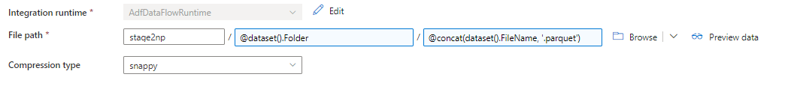

# Prerequisites

- An instance of Canvas with the data API's enabled.
- The ID of an Azure Subscription where we can deploy the Azure Durable Function used to download files.
- [Terraform CLI](https://www.terraform.io/cli) and [Azure Core Function Tools](https://docs.microsoft.com/en-us/azure/azure-functions/functions-run-local?tabs=v4%2Cwindows%2Ccsharp%2Cportal%2Cbash) installed on your machine for the initial deployment.
- A Synapse environment as deployed by the base OEA install where the pipeline can be configured.
- A Canvas environment with [Canvas Data enabled](https://community.canvaslms.com/t5/Canvas-Data-Users/Canvas-Data-FAQ/ta-p/251184), and API credentials as per [this page](https://community.canvaslms.com/t5/Admin-Guide/How-do-I-obtain-an-API-access-token-in-the-Canvas-Data-Portal/ta-p/157#:~:text=%20%20%201%20Open%20Account.%20Click%20the,the%20Create%20Credentials%20button.%20However%2C%20generating...%20More%20).

# Deploy the Azure Function
The Azure Funcion is required as it's used to synchronise files from the Canvas Data API.

- Clone this repository to your PC.
- With the OEA folder, open the [vars-template](https://github.com/microsoft/OpenEduAnalytics/blob/main/modules/Canvas_Data/function/deploy/vars-template.tfvars) file.
- Fill in all the variable fields with values to suit your environment and policy / governance requirements. It is recommended you follow the [Cloud Adoption Framework Naming Conventions](https://docs.microsoft.com/en-us/azure/cloud-adoption-framework/ready/azure-best-practices/resource-naming) for naming your Azure resources.
- Open PowerShell and navigate (using Change-Location) to `oea/modules/Canvas_Data/function/deploy`
- Type:
  ```
  terraform init
  terraform plan -var-file=vars-template.tfvars
  ```
- Review the plan output and ensure it's creating the appropriate resources (and not performing any deletions etc).
- Type:  `terraform deploy -var-file=vars-template.tfvars` to start the deployment. Follow any prompts.
  > **Warning:** At this point the .tfstate files within the  *deploy* directory can contain sensitive information including passwords and authentication keys.
  > Do not share this folder / place it into source control etc. 
- Wait for the deployment to finish. This may take ~10 minutes.
- Navigate to your Azure Portal and search for the resource group name you specified. Within the resource group you should see the Azure function, storage account and app insights instance.
- Open the function app and confirm you can see a list of functions under the 'Functions' blade. 
- Open the 'App Keys' blade and create a new host key titled OEA. Make note of the key value - this will be needed to setup the linked service in Synapse.

# Give the Function access to your Data Lake
The Azure Function deployed above requires read/write access to the stage1np/CanvasData folder and execute to the root of the stage1np container.

The function is deployed with an Azure managed identity by default.

To grant access to your Data Lake:

 - Navigate to the Azure Function instance.
 - Open the 'Identity' blade.
 - Ensure 'System assigned' identity is turned ON.
 - Copy the Object (principal) ID.
 - Open Azure Storage Explorer (either in the Azure Portal or the desktop app) and navigate to your OEA storage account.
 - Right-click Stage1np -> Manage ACLs, add a new entry using the Object (Principal) ID you copied from above. Grant `execute` permissions and turn **off** inheritance onto subfolders.
 - Under stage1np create a subfolder called CanvasData.
 - Right-Click CanvasData -> Manage ACLs, and create a new entry with `Read, Write and Execute` permissions for the Object (princpal) ID you copied. Be sure to turn **on** inheritance.

# Deploy Notebooks
You must include at least the CanvasData_CreateTables notebook for the pipeline to run, and can optionally import CanvasData_CreateEngagementView if required.

For each notebook that you import:
 - Open Synapse and navigate to the Develop tab.
 - Press the '+' icon in the top left and select import from the drop-down menu.
 - Navigate to Canvas_Data/notebook/ and select the relevant .ipynb file.
 - Once imported, pick your spark pool from the dropdown (tested on Spark v3) and press 'publish' to save changes.
 - Note you will be unable to run the notebooks without Canvas Data in stage2.

 # Configure Synapse Data Sources, Datasets & Pipelines
 Several pipelines, linked services and datasets are required for this module.
 
 Preference is to use the Synapse pipeline engine but Azure Data Factory can be used if the 'call notebook' step is removed from the syncCanvasData pipeline.

## Create Linked Services

### **Azure Function**
This linked service is used to invoke the Azure Durable Function and download files from Canvas Data, dynamically generate type translators from the schema, etc.

Setup as follows:
1. Open your Synapse/ADF workspace as an administrator. The account must also have reader access to the Azure Function and Resource Group.
2. Navigate to 'Manage' -> 'Linked Services'.
3. Click 'New', and search for / select 'Azure Function'.
4. Press 'Continue'.
5. Enter 'Canvas Data Lake Sync' as the name.
6. Under 'Azure Function App selection method', leave it on "From Azure subscription".
7. Navigate to the Azure Subscription and Function App Url where you deployed Canvas Data Lake Sync.
8. Either enter the Function Key here, or (if preferred) select 'Azure Key Vault' and select the key vault linked service and secret name.
9. Press Commit.

### **Data Lake Storage**
This linked service is needed so that the pipeline can interact with lake data. If using Synapse, you likely already have this setup as [Synapse Workspace Name]-workspaceDefaultStorage.

If not:
1. Open your Synapse/ADF workspace as an administrator. The account must also have reader access to the Azure Function and Resource Group.
2. Navigate to 'Manage' -> 'Linked Services'
3. Click 'New', and search for / select 'Azure Data Lake Storage Gen2'
4. Enter a name and navigate to your OEA Storage Account / Data Lake instance.
5. Press Commit.

## Create Data Sources

### **Adding the Stage1npData_CanvasDataFormat Dataset**
This dataset is used to read data landed by the Azure Function in stage1 to stage2.

This could be performed through a Synapse Notebook as well but in the interest of simplicity it is currently orchestrated through a Copy Activity.

In Synapse, press the '+' icon to add a new asset, select 'Integration dataset' (called Data Source in ADF).
 - Select 'Azure Data Lake Storage Gen2' as the connection type.
 - Select 'DelimtedText' as the source type.
 - Name the dataset 'Stage1npData_CanvasDataFormat'
 - Select your ADLS instance under 'linked service'
 - Click OK and save the dataset.
 - Navigate to the dataset and open the 'Parameters' tab.
 - Create two parameters - FileName [type String] and FolderName [type String]
 - Open the 'Connection' tab and enter details as follows:  
 - Note: Fields with a shaded blue background are using dynamic content - be sure to press the 'Add Dynamic Content' link that appears when selecting these fields.
 - Press commit to save changes.

### **Adding the Stage2npData_parquet Dataset**
This is the Copy Activity sink used to load data into stage2.

Again, this could be performed through a Spark Notebook (which would enable Delta format) - this has been avoided in the interest of keeping the process simple.

Canvas Data also maintains a full history of records, so the temporal analysis afforded by Delta Lake is in this case is redundant.

In Synapse, press the '+' icon to add a new asset, select 'Integration dataset' (called Data Source in ADF).
 - Select 'Azure Data Lake Storage Gen2' as the connection type.
 - Select 'Parquet' as the source type.
 - Name the dataset 'Stage2npData_Parquet'
 - Select your ADLS instance under 'linked service'
 - Click OK and save the dataset.
 - Navigate to the dataset and open the 'Parameters' tab.
 - Create two parameters - FileName [type String] and Folder [type String]
 - Open the 'Connection' tab and enter details as follows: 
 - Note: Fields with a shaded blue background are using dynamic content - be sure to press the 'Add Dynamic Content' link that appears when selecting these fields.
 - Press commit to save changes.

### Publish Dataset changes.

With both datasets setup, press 'Publish' to save your changes.

## Import Pipelines

1. Open Synapse.
2. Navigate to `Canvas_Data/pipelines`
3. Note pipelines should be imported in this order: `deleteCanvasStage2Files, processCanvasTableFiles, processCanvasDataFiles, reprocessAlStage2CanvasData, syncCanvasData` 
4. For each of the .json files in this folder:
   1. Click '+' in the top left and 
   2. In the top right press the '{}' icon to open the JSON View.
   3. Paste in the contents of the .json file.
   4. Press 'OK' followed by 'Commit'.
5. Press 'Publish' to persist all changes.

# Test the Pipeline
At this stage you should have everything required to run the pipeline. Open Synapse -> Pipelines -> CanvasData/syncCanvasData and click 'Debug' in the top bar to test the data load.

# Scheduling the pipeline.
A trigger can be added to the syncCanvasData pipeline to re-load Canvas data on a schedule - open the pipeline in Synapse, click Triggers -> new/edit triggers and follow the prompts.

It is sugggested the schedule is no more frequent than daily (Instructure only referesh the data daily) and that the execution is scheduled *after* 2am Mountain Time as this is when Instructure expect the data export to finish (as of time of writing).


# Troubleshooting
See [Troubleshooting](https://github.com/microsoft/OpenEduAnalytics/blob/main/modules/Canvas_Data/docs/Troubleshooting.md) in this folder (incomplete).
