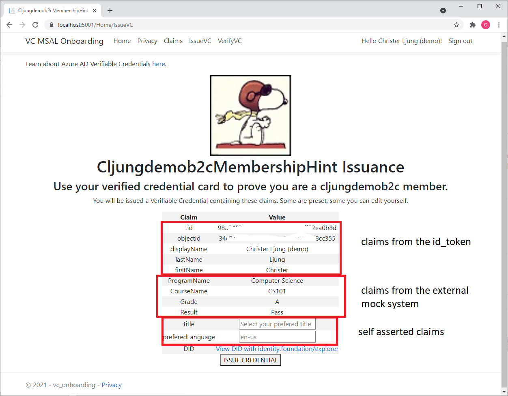

# VC Onboarding sample
This sample is an ASPNet core webapp that uses Azure AD B2C as its authentication authority. The signed in user can issue him/herself an Azure AD verifiable Credential. The claims will come from the user's claims, like displayName, and some other claims are directly added by the user in the web page, like title and prefered language.

## Live sample deployment
There is a live sample deployment that you can test [here](https://cljung-did-idtokenhint.azurewebsites.net/). Since it is B2C, you can use the self-service sign-up functionality and create your own account. Then you can issue yourself a VC.



## Updating appsettings.json
The app's config file contains two distinct sections that needs to be updated - one for Azure AD B2C and the other for Azure AD Verifiable Credentials.

The Azure AD B2C section looks like below. It is standard B2C stuff, which means you need to replace `yourtenant` with the name of your B2C tenant. You also need to add the names of your B2C policies. The `ClientId` is the B2C App Registration and it needs to have your deployments url as a valid redirect_uri. For the live sample app, this value is `https://cljung-did-idtokenhint.azurewebsites.net/signin-oidc`.

```json
  "AzureAdB2C": {
    "Instance": "https://yourtenant.b2clogin.com/tfp",
    "ClientId": "<YOURCLIENTID-B2C>",
    "Domain": "yourtenant.onmicrosoft.com",
    "SignedOutCallbackPath": "/signout/B2C_1_susi",
    "SignUpSignInPolicyId": "B2C_1_susi",
    "ResetPasswordPolicyId": "B2C_1_PasswordReset",
    "EditProfilePolicyId": "B2C_1_ProfileEdit",
    "CallbackPath": "/signin-oidc"
  },
```

The other section controls Verifiable Credential settings. You need to update `TenantId`, `ClientId`, `ClientSecret`, and `DidManifest`. For the first three, please see the [Adding Authorization](https://github.com/cljung/did-samples/#adding-authorization) for background on what they represent, but they are a way of creating an access token, via client credentials, that authorize us to the VC Client API. The `DidManifest` is the url to your VC credential.

```json
  "AppSettings": {
    "ApiEndpoint": "https://beta.did.msidentity.com/v1.0/{0}/verifiablecredentials/request",
    "TenantId": "<YOURTENANTID-THAT-PROTECTS-AZUREKEYVAULT-FOR-DID>",
    "Authority": "https://login.microsoftonline.com/{0}",
    "scope": "bbb94529-53a3-4be5-a069-7eaf2712b826/.default",
    "ClientId": "<YOURCLIENTID-DID>",
    "ClientSecret": "<YOURCLIENTSECRET-DID>",
    "ApiKey": "not used",
    "CookieKey": "state",
    "CookieExpiresInSeconds": 7200,
    "CacheExpiresInSeconds": 300,
    "client_name": "VC MSAL B2C Onboarding",
    "DidManifest": "<YOUR-DID-MANIFEST-URL>",
    "ExternalEndpoint": "https://your-name.azurewebsites.net/api/EduUserProfile?code=......",
    "ExternalClaims": "ProgramName,CourseName,Grade,Result",
    "SelfAssertedClaims": "title:Select your prefered title,preferedLanguage:en-us"
  }

```

## Running the sample
The sample is self contained and contains the callback APIs that the VC Client API uses (see the ApiVCController.cs). That means that the webapp needs a public endpoint and will not work with localhost. If you want to get something running fast, you can use `ngrok` as an temp App Proxy.

## Switching from B2C to Azure AD
If you prefer to signin to and Azure AD instance instead of B2C, you need to make two changes.

### Startup.cs
In Startup.cs you need to switch which line is commented out.

```CSharp
public void ConfigureServices(IServiceCollection services)
{
    services.AddAuthentication(OpenIdConnectDefaults.AuthenticationScheme)
        .AddMicrosoftIdentityWebApp(Configuration.GetSection("AzureAdB2C")); // if you use Azure AD B2C to sign in to
    //    .AddMicrosoftIdentityWebApp(Configuration.GetSection("AzureAd"));   // if you use Azure AD to sign in to

```

### appsettings.json
In appsettings.json, you need to update the `AzureAd` section with information of your AAD tenant and the `ClientId` of your App Registration there. 
When you do the App Registration, you need to go into `Token configuration` to add `family_name` and `given_name` for the `ID` Token type.

```JSON
  "AzureAd": {
    "Instance": "https://login.microsoftonline.com/",
    "Domain": "<YOURDOMAIN.com>",
    "TenantId": "<YOURTENANTID-THAT-YOU-LOGIN-TO>",
    "ClientId": "<YOURCLIENTID-THAT-YOU-LOGIN-TO>",
    "CallbackPath": "/signin-oidc"
  },
```

### Adding a mock External system for additional claims

If you do nothing, the claims in the VC will be from your Identity Providers id_token and two self asserted claims (title + prefered language). 
But If you want to add some more claims that simulates coming from an external system, you can configure a REST API endpoint that gets called and fetches some more claims.
There is a mock up endpoint in the [ExternalSystem](ExternalSystem) folder that contains code for an Azure Function that stores some mock up data for an Educational scenario.

### Deploy the Azure Function

First, you need to create an Azure Function of type HttpTrigger in portal.azure.com. This will auto-create the `run.csx` and `function.json` for you. 
In the code editor in portal.azure.com, make sure you select each file and copy-n-paste over the contents of each file from this github repo. 
But, there is also another step you must perform - create the file `function.proj`. This file is needed as it references the needed dotnet Assemblies for working with Azure Table Storage.
The easies way to create this file is to click on the `Console` menu item in portal.azure.com for the Azure Function, then `cd` into your folder in the web based command prompt
and finally issue the command `copy function.json function.proj`. This will create a file that we then can edit in the Azure Function code editor. 
Open the file and copy-n-paste over the contents of the file from the same file in this github repo. Finally, open `run.csx`, make some unimportant change and press `Save` to see that there are no errors.

The Azure Function uses Azure Table Storage to hold the extra claims per user. You need to create an Azure Storage account and add the connect string in the configuration for it.
This configuration should be added under `Applictation settings`.

```json
  {
    "name": "EDU_STORAGE_CONNECTSTRING",
    "value": "DefaultEndpointsProtocol=https;AccountName=apacstg01;AccountKey=...;EndpointSuffix=core.windows.net",
    "slotSetting": false
  },
```
### Add som sample data

You can import some test data for a user by invoking the Azure Function from a powershell command prompt, like below.

```Powershell
$url = "https://your-name.azurewebsites.net/api/EduUserProfile?code=..."
$body = @"
{
"op": "save",
"objectId": "...user's objectId in your IDP...'",
"ProgramName": "Computer Science",
"CourseName": "CS101",
"Grade": "A",
"Result": "Pass"
}
"@
Invoke-RestMethod -Uri $url -Method "POST" -ContentType "application/json" -Body $body
```

In order to test that it works, you can retrieve it with this payload body

```Powershell
$body = @"
{
"op": "get",
"objectId": "...user's objectId in your IDP...'"
}
"@```